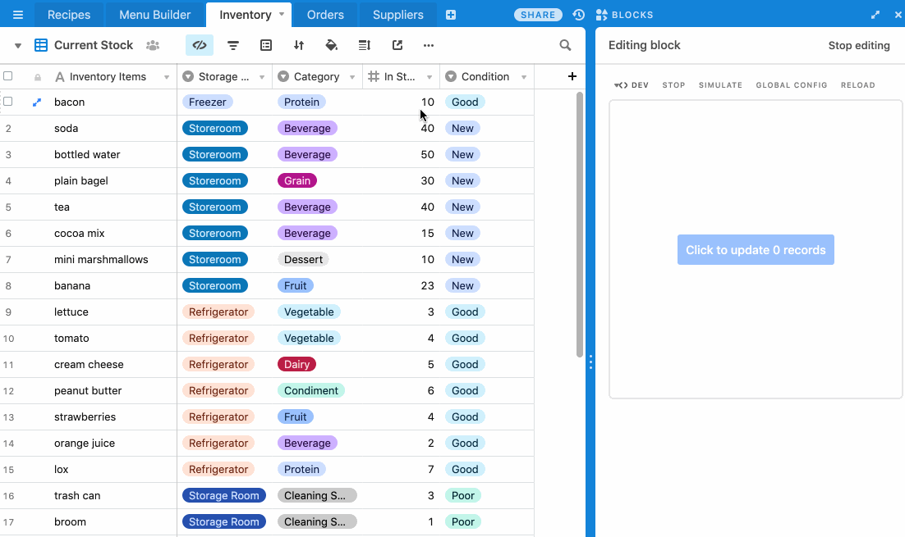

# Update records block

This example block updates the cell values of the selected records in your base, adding 1 to the
current cell value of a field in each record.

The code shows:

-   How to use the Cursor API to detect when a user has selected records in grid view, and how to
    get the selected records.

-   How to update multiple records from your block.

-   How to check if the user has write permissions before performing an update.

## How to run this block

1. Create a new base using the
   [Menu Planning template](https://airtable.com/templates/event-planning/expvAPRfjIaE5Js68/menu-planning)

2. Create a new block in your new base (see
   [Create a new block](https://airtable.com/developers/blocks/guides/hello-world-tutorial#create-a-new-block),
   selecting "Update records" as your template.

3. From the root of your new block, run `block run`.

## See the block running

